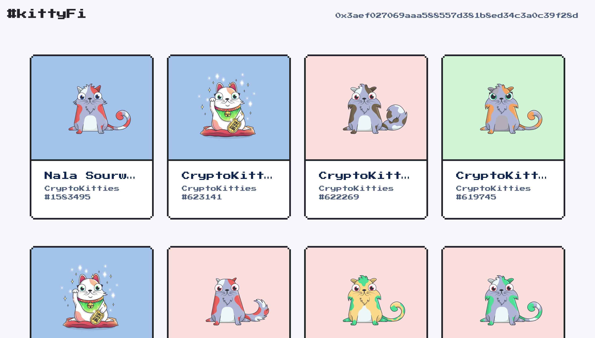

# #kittyFi
genetically unique purrs for each genetically unique cat

ETHNewYork Prize Winner for Best Cryptokitty/Dapper Wallet Hack
 - https://medium.com/dapperlabs/results-from-the-dapper-and-cryptokitties-hackathon-at-ethnewyork-5af46a2b1edc
 - https://twitter.com/CryptoKitties/status/1130880238773129222
 - https://twitter.com/hellodapper/status/1130885078517596161

check out the full demo on [youtube](https://youtu.be/Jj5-hgjXLkA) or play around with the actual [hack](https://kittyfi.netlify.com/) (warning: it's not super mobile friendly 😅)

## Inspiration
if you've ever played pokemon, you know that each pokemon has a unique cry/call

i took that idea and applied it to cryptokitties!

name inspiration: kitty + spotify + #defi

## What it does
explorer for cryptokitties (search by kitty id or login win your eth wallet)

uniqueness factor: if you click on a cat, it will make its unique purr!

## How I built it
frontend react client + sound generation algorithm

sound generation: takes 256 bit genetic code and maps parts of the codes to sound opcodes for the gameboy

tools used:
 - opensea api/cryptokitties api: display informational data (name, images, etc)
 - web3: query the cryptokitties smart contract to get a kitty's unique genetic code
 - dapper wallet: for signing in to app and displaying a dashboard
 - infura: if no ethereum wallet installed, automatically connects to mainnet infura node to still search/grab genetic data from the blockchain

## Challenges I ran into
 - the hardest part was the sound generation aspect. starting from a 256 bit string, i wanted to somehow generate a short sound clip from it (using the 3 sound channels found on a gameboy). there wasn't enough entropy in the initial genetic code, so i decided to take portions of it and hash it (key stretch) to obtain longer pseudorandom string to create sound opcodes from. just trying to understand the gameboy opcodes was already super hard
 - next, after generating unique sounds, i needed to be take the opcodes that i generated and play them. this was the part i struggled the most with as i actually couldnt figure this out so what you're hearing are some of the sounds that i already pregenerated

## Accomplishments that I'm proud of
building a work app and figuring out how to generate random and unique sounds from a kitties genetic code was super cool. for future work, i want to complete what i built and actually be able to play the sounds from the opcodes i generated.

## What I learned
- how the pokemon games use the gameboy's audio channels to generate/play pokemon cries: [watch this if you want to learn more](https://www.youtube.com/watch?v=gDLpbFXnpeY)
- how to use web3 to query the blockchain
- how to use external apis in my react app

## What's next for #kittyFi
maybe go further than just unique sounds/purrs, but a music jukebox (progressively generate a soundtrack using musenet from notes mapped from genetic code)